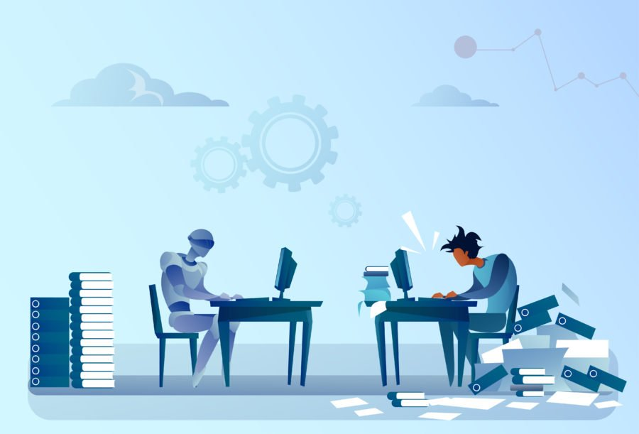
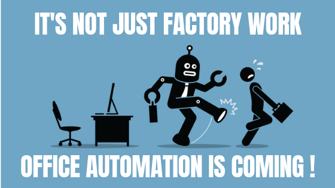

# Work Automation

__In pursuit of automation of mundane tasks__

My goal is to ruthlessly eliminate any task that consumes time which, in my opinion, can be easily automated.

At the work place, you will find yourself doing the same kind of work day in day out to a point where you become a veteran of execution due to habituation. We learn to do things so well over time such that we do not have to think about them so much.

But, what if we can automate these things using a computer? Wouldn't it save us:

* (individuals) the mental power to focus on more creative stuff that make us happy and more valuable?

* And (the company) will maximise its utilization of resources at its disposal?

I am looking at this from two perspectives:

1. Personal: I can become more productive at work (for self improvement)

2. Company: If I can create something useful that will simplify work, and save the compay a ton of money, what a way to serve others?!

_This is my endevour for the next couple of months._

**To an easy life here on planet earth...toast!!**

